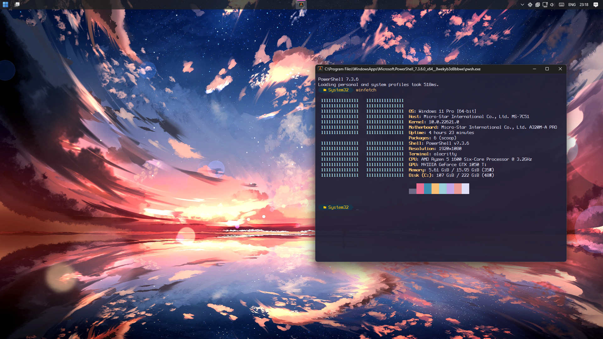

## win11dotfiles is a
Nixified Windows resources repository.

Screenshots

### Manual Installation:
#### Prerequisites:
-[Firefox](https://www.mozilla.org/en-US/firefox/new/)
[uBlock Origin](https://addons.mozilla.org/en-US/firefox/addon/ublock-origin/) 
[Purple Night Theme](https://addons.mozilla.org/en-US/firefox/addon/purple-night-theme/)
[Nighttime Stars Animated Theme](https://addons.mozilla.org/en-US/firefox/addon/nighttime-stars-animated-theme/)  
-[Discord](https://discord.com/)  
-[Better Discord](https://betterdiscord.app/)
[Image Utilities](https://betterdiscord.app/plugin/ImageUtilities)
[Platform Indicators](https://betterdiscord.app/plugin/PlatformIndicators)
[Emoji Replace (Joypixels)](https://betterdiscord.app/theme/EmojiReplace)
[Theme](https://betterdiscord.app/theme/Spectra) 

-[Taskbarx](https://github.com/ChrisAnd1998/TaskbarX)  
-[ExplorerPatcher](https://github.com/valinet/ExplorerPatcher) 

-[Alacritty](https://github.com/alacritty/alacritty)  
-[Oh My Posh](https://github.com/jandedobbeleer/oh-my-posh)  

-[AltDrag](https://github.com/stefansundin/altdrag/)  
-[Twinkle Tray](https://www.microsoft.com/store/productid/9PLJWWSV01LK)  
-[WinaeroTweaker](https://winaero.com/winaero-tweaker/)  
 
###  Cool Software I Don't Use:  

-[pyWinContext](https://github.com/VodBox/pyWinContext)  
-[Files](https://github.com/files-community/files/)  
-[Dexpot](https://www.dexpot.de/?lang=en)  
 
## Why windows 11? 
Looks great.  
Discord [microphone tray](https://support.discord.com/hc/en-us/community/posts/12587717927703--Linux-Icon-Tray) works.  
Discord [screenshare audio](https://support.discord.com/hc/en-us/community/posts/360050971374-Linux-Screen-Share-Sound-Support) works.  
Davinci resolve doesn't have [issues](https://youtu.be/F1dOZ_CJPfc?si=Qq6dRz0yC-h9-eQd).  

## Why not windows 11?
[Explorer](https://www.howtogeek.com/884624/youre-not-alone-windows-11-is-randomly-opening-file-explorer/)  
Slow bootup time.  
Applications take forever to load.  
Bloated and very tedious to unbloat.  
No small taskbar without 3rd party applications.  
Windows update on harddisks:  
  
  
